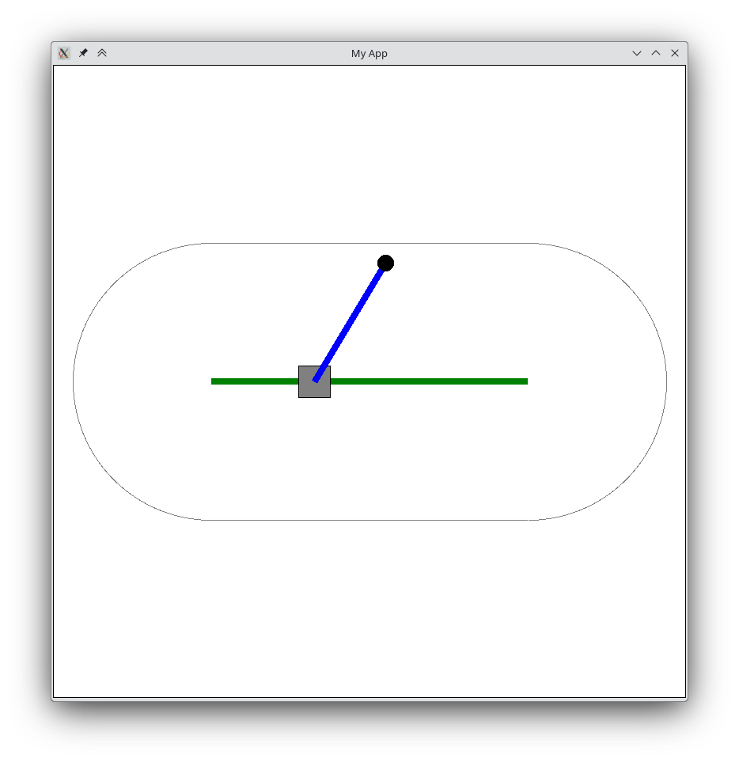

# Translation Rotation Robot
## Intro


In this exercise, we will simulate the kinematics of a translation-rotation robot. While it is possible to derive an analytic solution for the kinematics of such a simple robot, we will use a numerical approach instead. With the help of Newton's method, we will derive the two joint angles that are required to reach a given target position.



The joint angle is measured in radians relative to the horizontal x-axis. Note, that on a computer the coordinate system is flipped vertically. This means, that the y-axis points downwards. Therefore positive angles are measured clockwise.

## Step 1: Drawing the robot

The application template in this repository contains a class App to create an application window and a class Point, which makes it a bit easier to work with 2D points.

As a first step, draw the robot according to the screenshot above. Make sure that you draw the robot within the main loop of the application. This way, the robot will be redrawn continuously and can be animated later.


Hint: Think about how you will handle the position of the origin of your drawing. Add sliders, which allow to change the length and angles of the two arms.


## Step 2: Formulating the problem

Now we can start formulating the problem as a system of equations. We want to find the translation offset <em>off</em> and joint angle <em>phi1</em> that are required to reach a given target position. We get two non-linear equations for the x- and y-coordinate. 

In order to solve this non-linear system of equations, we will use Newton's method, which given a starting value will iteratively compute a solution. In order to use Newton's method, we need to reformulate our system of equations as a root finding problem. That is, we need to define a function whose roots are the solutions of our system of equations.


The example:

$$\begin{array}{c}x^2+9x+y &=& 5\\ 7\cos(y)+2x^2 &=& -3\end{array}$$

Results in the following multi-dimensional function:

$$f(v) = f\begin{pmatrix}x\\ y\end{pmatrix} = \begin{pmatrix}f_1(v)\\ f_2(v)\end{pmatrix} = \left(\begin{array}{c}x^2+9x+y - 5\\ 7\cos(y)+2x^2 + 3\end{array}\right)$$

And we want to find the vector $v=\begin{pmatrix}x\\ y\end{pmatrix}$ with:

$$f(v) = \left(\begin{array}{c}x^2+9x+y - 5\\ 7\cos(y)+2x^2 + 3\end{array}\right) = \begin{pmatrix}0\\ 0\end{pmatrix}$$ 

Express the the given robot system in terms of such a function f and implement this function in Python. What do the inputs (parameters) and outputs (return values) of this function mean?


Hint: The function f changes depending on the target position, which you want to reach. In Python you can create a higher order function for this. A higher order function is a function which returns a function.


Example: 
```
def robotFunc(targetPos:Point)
    def f(v:np.ndarray):
        return np.array([f1(v) - targetPos.x, f2(v) - targetPos.y])
    return f
```


## Step 3: Implementing Newton's method

The basic update rule of Newton's method is:

$$v_{n+1} = v_n - \frac{f(v)}{f'(v)}$$

In the multi-dimensional case, the derivative is given by the Jacobian-Matrix which contains all partial derivatives. We get:

$$v_{n+1} = v_n - J^{-1}(v)\cdot{}f(v)$$

Implement Newton's method for the multi-dimensional case in Python. The application template already contains a <em>jacobi</em> function to compute the Jacobian-Matrix. Make sure to test your implementation well and make sure it returns correct values.

## Step 4: Putting it all together

Update the target position of the robot when the user clicks on the canvas. Then run Newton's method to update the robot position and redraw it.
